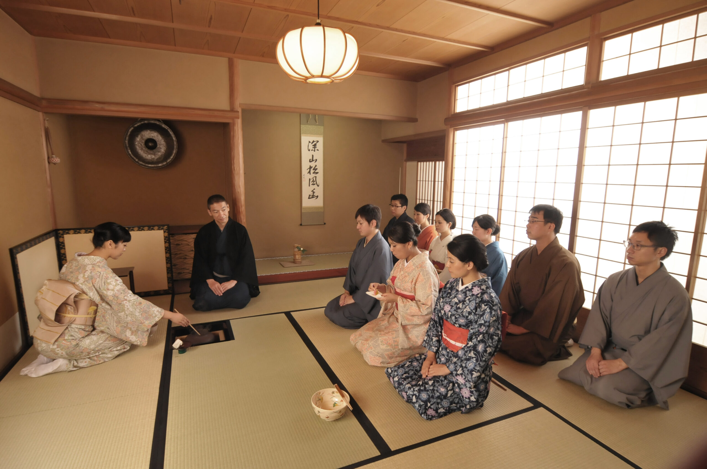

Chado is a Japanese Tea Ceremony, that places an emphasis on creating a bond between the Host and the Guest through a rigid ceremony. One way the ceremony creates this bond is having a small entramce point which forces each guess to bow before entering, so no matter how highly ranked you are you are but a humble guest. Before the ceremony, there are many points where the guest must must show respect to the decorations that the host had prepared for them. When the guest is seated sweets, are brought to them by the host and then which the host starts the tea making ceremony. The ceremony consist of many rigid steps and specific tools to show resepct to the guest.

In my Fall 2024, Chado class, we had the oppurtunity to plan our own cereomony where we hosted the other half of the class. In Chado, you are allowed to place a theme on your ceremony which can range from holidays, places, maybe something personal to you. This ceremony we decided to have a Hawaiin Luau theme with decorations and Hawaiin sweets. I had the privilage of making the sweets for this ceremony and decided to make Butter Mochi.

In this project, I really enjoyed the sense of community that was shared amongt our guest. I also enjoyed learning another part of Japanese culture that I did not know before.
