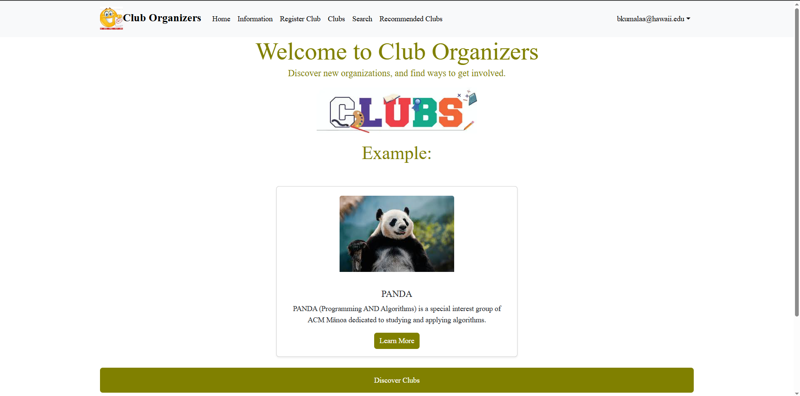

  Club Organizers is a centralized platform dedicated to showcasing the diverse range of student organizations at the University of Hawaiʻi at Mānoa. With over 150 Registered Independent Organizations (RIOs) on campus, students have countless opportunities to get involved, connect with others, and pursue their interests. However, finding clear and up-to-date information about these organizations can be a challenge. Club Organizers aims to bridge that gap by offering an easy-to-navigate space where students can discover clubs, access contact details, stay updated on events, and engage with the vibrant UH Mānoa community.

  In this project, I have applied the skills I have learned in while working on game development to successfully create an application that we believed our school needs. It highlighted the importance of communication and developing clear goals. We set small goals for ourselves and to always be working on something. This set expectations and let us be communicative about our troubles and work through them together. This experience has improved my ability to navigate github and using it as a way to communicate with my teammates. Overall, this project was a good foundation to build off of for my future.

[Overview](https://club-organizers.github.io/)
[Github](https://github.com/club-organizers/club-main)
