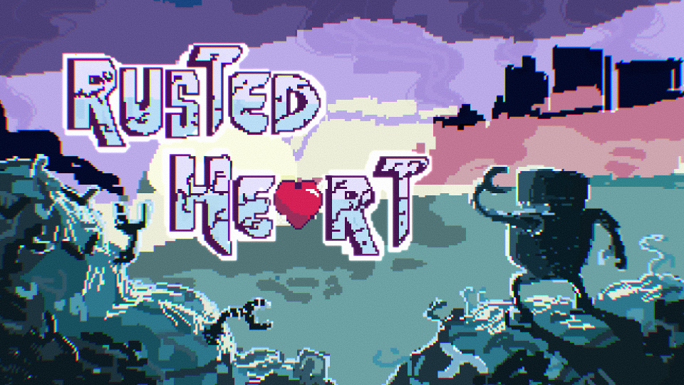

Rusted Heart is a game I had a hand in making during the Fall 2024 semester at the Game Dev at UH Manoa club. The game is a rythmn game, where you are a robot trying to repair your sisters heart through various rythmn battles

This was my first project with the club, and the first thing that noticed about the club is the amount of people participating in the club. I had never worked on a project with more than 5 people but this project included 25 or more people in it. People are divided into several groups consisting of Music, Coding, Art, and Writing. While I wanted to do coding, there were too many coders that semester but not enough people in music, so I decided to join the Music group. 

I had never done Music before, but I like to learn new things so this was an exciting expirience for me. I learned alot about team communication and time management. This is because if one person falls behind on their, the whole project could be set back. But I found that as long as you communicate your troubles, you can work with your team to find solutions. 

[Game](https://uhmanoagamedev.itch.io/rusted-heart)
